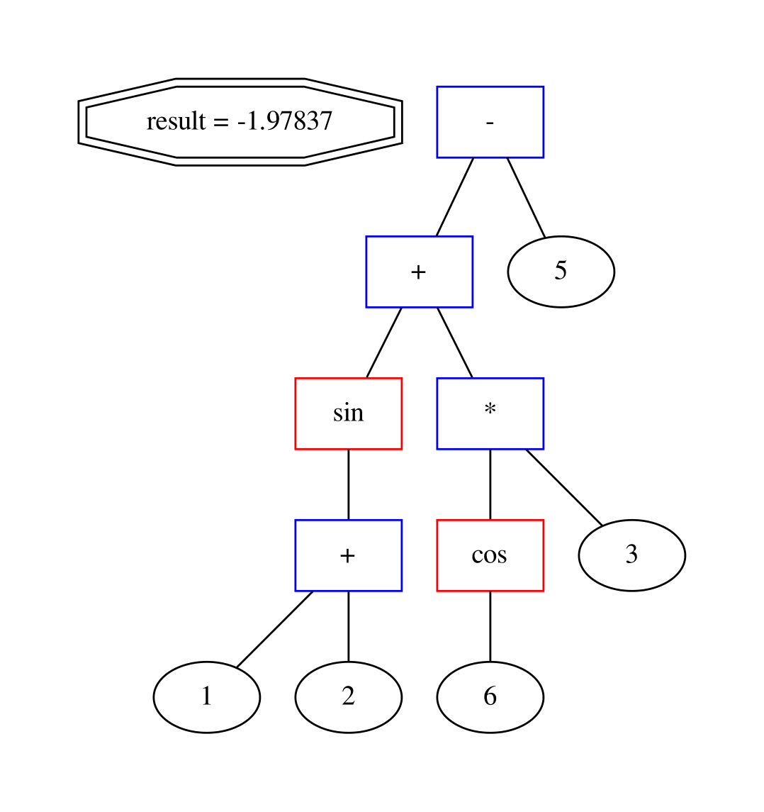

# Recursive descent parser

Sorry for mix c/c++, because
I just started writing in c++.\
The code will improve.

There is no differentiator!\
It supports: + - * / ^ sin cos\
And dumps to graviz or tex
## Description
```bash
Grammar:
G::= E '$'
E::= T{['+', '-']T}*
T::= S{['*', '/']S}*
S::= P{['^']P}*
P::= '(' E ')' | N | ID '(' E ')'
N::=['0'-'9']+
```

It works with spaces\
sin(1+2)+cos(6)*3-5 or\
sin( 1 + 2) + cos(6) * 3 - 5\

## Installing
```bash
git clone https://github.com/vvdvortsova/recursive_descent_parser.git
```
For latex
```bash
sudo apt-get install texlive-latex-base
```
For graviz for Ubuntu
```bash
sudo apt install graphviz
```
## Structure
- Source project 
    - src/
- Test project
    - test/
## Run

How to run
```bash
cmake .
make
./treeExpr [flag] [outfile] [expr]
```
flags
```bash
-a Creates graviz dump and call dot
   and creates tex dump and call pdflatex
-g Creates graviz dump and call dot
-t Creates tex dump and call pdflatex
-v Creates tex dump and graviz
   do not call dot and pdflatex
Without params is like -a
```
For latex
```bash
pdflatex tex1.tex
```
For graviz
```bash
 dot -Tpdf gr1.dot -o gr1.pdf
```
Example:
```bash
./treeExpr -a test1 "sin(1 + 2) + cos(6) * 3 - 5"
```

OutFiles
```bash
test1_grav.dot
test1_grav.pdf
test1_tex.aux
test1_tex.log
test1_tex.pdf
test1_tex.tex
```


## Documentation
You can watch documentation by opening
```docs/html/index.html ``` in browser.

## OS
 KUbuntu 18.04
